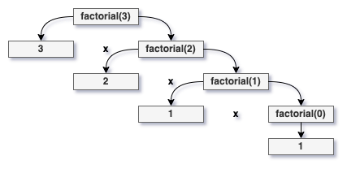
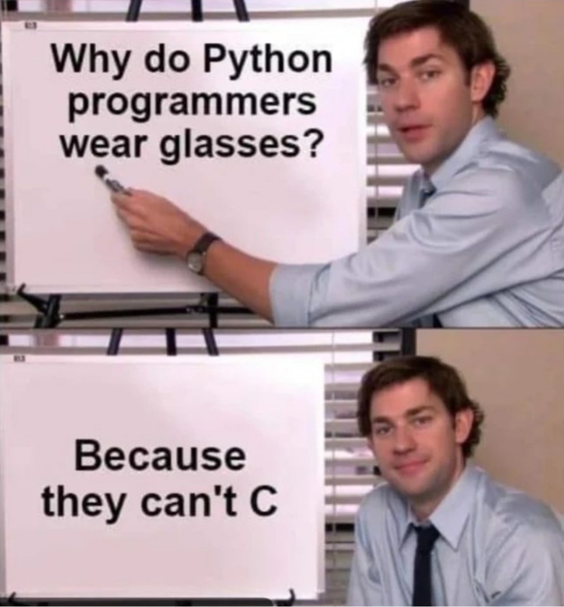

# Exam #02 Review Session

Exam #02 will be held during your regular lecture period on **Thursday, April 2, 2024**.

All topics that have been covered in class up until this point are fair game, though the main focus will be on (bolded topics are heavily weighted on the exam)...

- **Pointers**
- References
- **Arrays (1D and 2D)**
- **Recursion**
- Basic debugging
- Binary search
- **Code tracing**

## Pointers

What is a pointer?

> A pointer is a special type of variable whose value is the **memory address** of another variable.

Here's a simple example of what that might look like...

```c++
int main () {
    int value = 25;
    int * pointer = &value;

    // We know that the statement below outputs "25"
    std::cout << value << std::endl;

    // What does this statement do?
    std::cout << pointer << std::endl;

    // How about this one?
    std::cout << (*pointer) << std::endl;

    return 0;
}
```

Take a moment to consider the code above. Despite looking very similar, the two print statements after printing our value behave quite differently.

- ``std::cout << pointer << std::endl;`` outputs the **memory address** the pointer is pointing to.
- ``std::cout << (*pointer) << std::endl;`` dereferences the pointer and outputs the **value stored** at that memory address.

## References

What is a reference?

> A reference is an **alias** for another variable. In other words, it's just another name for the same memory location.

Here's a simple example of what that might look like...

```c++
int main() {
    int val1 = 1, val2 = 5;
    int &ref = val1;

    // What's the difference between these two lines?
    val1 += 1;
    ref += 1;

    // What's happening here?
    ref = val2;

    // Does this modify 'val1' or 'val2'?
    ref *= 2;

    return 0;
}
```

References have a lot of similarities to pointers, but are a little kinder to us when it comes to modifying the values they hold and not the memory address.

- ``val1 += 1;`` and ``ref += 1;`` actually both behave the same as 'ref' is currently referencing val1. Therefore, both add 1 to the value at 'val1'.
- ``ref = val2;`` reassigns what 'ref' is referencing, it does not replacing the value it's referencing. In other words, 'ref' now references 'val2' from this point onward.
- ``ref *= 2;`` will, as a result of the reassignment made prior, multiply 'val2' by 2.

## Arrays (1D and 2D)

What is an array?

> An array is a **contiguous** sequence of elements of the **same type**.
>
> Each element (data in array) can be accessed using its **index**.

Below are some simple snippets to populate both 1D & 2D arrays...

**Example creation and population of a 1D array:**

```c++
int main () {
    int array_size;
    std::cin >> array_size;

    int my_array[array_size];

    for (int i = 0; i < array_size; i++) {
        std::cin >> my_array[i];
    }

    return 0;
}
```

**Example creation and population of a 2D array:**

```c++
int main () {
    int array_height, array_width;
    std::cin >> array_height >> array_width;

    int my_array[array_height][array_width];

    for (int h = 0; h < array_height; h++) {
        for (int w = 0; w < array_width; w++) {
            std::cin >> my_array[h][w];
        }
    }

    return 0;
}
```

As you can see above, arrays have a few general rules.

- Array declarations require that a size be specified.
- Elements in an array **must be initialized** before use.
- Individual elements of an array are accessed using square brackets [].

Be careful when using arrays with functions!

- Arrays can be passed into functions either as arrays (``int arr[]``) or as pointers (``int * arr``).
- 2D arrays require that you pass the size of the inner array in alongside them (``int arr[][10]``).

Something to note - arrays behave very similarly to pointers, which becomes incredibly useful when it comes to things like recursion.

## Recursion

What is recursion?

> Recursion is a problem solving technique in which we solve a task by reducing it to smaller tasks (of the same kind). Then, use the same approach to solve the smaller tasks.
>
> Technically, a recursive function is one that **calls itself**.

Here's a simple recursive function to calculate a factorial...

```c++
int factorial (int n) {
    // Base case
    if (n == 0) {
        return 1;
    }

    // Recursive call
    return factorial(n - 1) * n;
}
```

As you can see, the function above is comprised of a few key factors.

- The **base case** is the condition that must be met for your recursion to stop - it's almost comparable to the condition of a while/for loop.
- The **recursive call** is what actually powers our function, making a call back to the function itself and multiplying its return value by n to get our factorial.

For your exam, you should be comfortable drawing a recursion tree for something like the function above. Here is the recursion tree for that given function.



## Basic Debugging

There's not much to say about debugging - you just have to know your stuff! That said, you should keep in mind the types of errors you might encounter.

- **Syntax errors** prevent a program from compiling entirely and occur when something is written incorrectly.
- **Semantic errors** are tricky and will allow the program to compile and run, but cause the output to stray away from what's expected.

Here is an example of a syntax error...

```c++
int main() {
    int test = 0;

    if test == 10 {
        std::cout << "Hello World" << std::endl;
    }
    else {
        std::cout << "foo bar" << std::endl;
    }
    return 0;
}
```

Here is an example of a semantic error...

```c++
#include <iostream>
int main() {
    int test = 0;

    if (test == 0) 
        std::cout << "Hello World" << std::endl;
        std::cout << "Hello World2" << std::endl;
    else {
        std::cout << "foo bar" << std::endl;
    }
    return 0;
}
```

What's wrong with these programs?

- The syntax error example does not include parentheses around the condition ``test == 10`` and will therefore throw an error at compile time.
- The semantic error example includes a conditional ``if (test == 0)`` but does not wrap the lines that fall under that condition in {}.

## Binary Search

What is Binary Search?

> Binary Search is a search algorithm to find a given value within a **sorted array**.
>
> The algorithm compares the value to the middle element. If they are not equal, one of the half is eliminated and the search continues on the other half. This process repeats until the value is found or no more elements are left (value is not in the array).
>
> Binary search is **faster than linear search**.

Here's the code for a Binary Serach...

```c++
int bin_search (int * A, int lo, int hi, int k) {
    // Base case
    if (hi < lo) {
        return NOT_FOUND;
    }

    // Calculate midpoint index
    int mid = lo + ((hi - lo) / 2);

    // Key (value) found?
    if (A[mid] == k) {
        return mid;
    }

    // Key (value) in upper subarray?
    if (A[mid] < k) {
        return bin_search(A, mid + 1, hi, k);
    }

    // Key (value) is in lower subarray?
    return bin_search(A, lo, mid - 1, k);
}
```

From the code above, we can see why this algorithm only works on sorted arrays as it assumes that if our key (value) is greather/less than the midpoint, it is after/before the midpoint in the array.

You may also notice that this function is recursive - fun!

## Code Tracing

Tracing code is a vital skill as it's essentially the equivalent of reading in computer science. You should be able to read through a program and have a general understanding of what's going on by the end, even if you don't necessarily know the details of how exactly everything happens.

As an example, consider what the resulting values of a, b, and c might be after running the code snippet below.

```c++
int a = 2, b = 0, c = -1;

int & d = a;
int & e = b;

d = e - c;
c *= -1;
a *= 15;
e = a;
```

Hopefully, this was a breeze for you now! The references are a little tricky but you final values should be ``a = 15, b = 15, c = 1``.

## Conclusion

That's all folks! Well, not everything, but hopefully you feel a bit better about the big topics on your upcoming exam.

Best of luck - you've got this!


