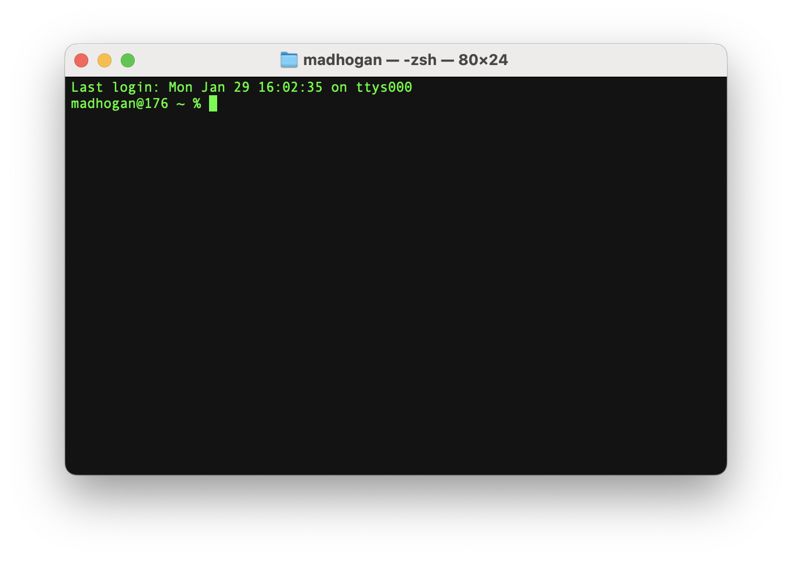

# The Command Line

These days, we have a variety of different command line interfaces, but what actually is a command line? Great question! Let's take a look...

Look familiar? That's right, the Terminal application on macOS is the command line for Mac users!

On Windows, you have the option of Command Prompt or Windows Powershell, where Powershell is generally more user-friendly. Windows, however, is not a unix-based operating system, meaning some shell commands are not supported. To resolve this, many users have opted to utilize the [Windows Subsystem for Linux (WSL)](https://learn.microsoft.com/en-us/windows/wsl/about) to simulate a unix evironment.

## Shell Commands

Now then, what's the point of this matrix-esque window on our screen? To answer this question, we need consider a time where computing was simple... really simple.

:max_bytes(150000):strip_icc()/apple-macintosh-classic-computer-118265826-5c3c0896c9e77c0001dfbfef.jpg "The Macintosh")

*Apple's "Macintosh", 1984*

Back in the mid to late '80s when computers looked a lot like this (The Macintosh, Apple, 1984), the command line essentially *was* your operating system! But wait - where's my finder? How do I navigate through my files? Run programs?

Welcome, my friends, to shell commands.

| Command | Information | Example |
| --- | --- | --- |
| [cat](https://ss64.com/bash/cat.html) | Concatenate and print (display) the content of files. | ``cat someFile.txt`` |
| [cd](https://ss64.com/bash/cd.html)* | Change Directory - change the current working directory to a specific Folder. | ``cd /Users/madhogan/Documents`` |
| [cp](https://ss64.com/bash/cp.html) | Copy one or more files to another location. Copy SOURCE to DEST, or multiple SOURCE(s) to DIRECTORY. | ``cp demofile demofile.bak`` |
| [echo](https://ss64.com/bash/echo.html)* | Display message on screen, writes each given STRING to standard output, with a space between each and a newline after the last one. | ``echo "Hello, World!"`` |
| [grep](https://ss64.com/bash/grep.html) | Search file(s) for specific text. | ``grep "Needle in a Haystack" /etc/*`` |
| [ls](https://ss64.com/bash/ls.html)* | List information about files. | ``ls -al`` |
| [man](https://ss64.com/bash/man.html) | Format and display help pages. | ``man intro`` |
| [mkdir](https://ss64.com/bash/mkdir.html)* | Create new folder(s), if they do not already exist. | ``mkdir -p demo`` |
| [mv](https://ss64.com/bash/mv.html)* | Move or rename files or directories. | Rename the file apple as orange.doc: ``mv apple orange.doc``.    Move orange.doc to the Documents folder: ``mv orange.doc ~/Documents/orange.doc``. |
| [pwd](https://ss64.com/bash/pwd.html)* | Print Working Directory (shell builtin) | ``pwd [-LP]`` |
| [rm](https://ss64.com/bash/rm.html)* | Remove files (delete/unlink). | ``rm demo.txt`` |
| [rmdir](https://ss64.com/bash/rmdir.html)* | Remove directory, this command will only work if the folders are empty. | ``rmdir myfolder`` |
| [touch](https://ss64.com/bash/touch.html)* | Change file timestamps, change the access and/or modification times of the specified files. *(We use this command to make files!)* | ``touch sample.txt`` |

*Information via [ss64.com](https://ss64.com/bash/).*

**Note**: The list above is by no means complete. In fact, it's actually just a small selection! If you would like to check out some other shell commands, [check them out here](https://ss64.com/bash/).

*Frequently used in CSC 211.

## Command Line Operators

Shell commands are cool, right? There's a lot you can do with just the list in the section above! But what if I told you it gets even better?

Similar to logical operators in C/C++, or any language for that matter, the command line supports command line operators for more efficient or even multiple operations. Here are a few of the most frequented command line operators...

| Operator | Information | Example |
| --- | --- | --- |
| \| | The **pipe** operator directs the output of the preceding command as input to the succeeding command. It is most commonly used to filter data with the grep command. | ``cat test \| grep -i "makeuseof"`` |
| && | This operator functions in similar ways to the semicolon operator except, unlike the semicolon operator, AND operator will execute commands only if the preceding command was successfully executed. | ``pwd && mkdir test && cd test && bad_command && ls`` |
| \|\| | The OR operator will execute the command that follows only if the preceding command fails, i.e., returns an exit code of 0. It functions like a logical OR gate, which returns a value of 1 when the input is 0. | ``bad_command \|\| ls`` |
| >> | The redirection operators redirect output or input to a file either by re-writing the file or by appending to it. If you want to re-write a file, then you have to use the single angle bracket (>) syntax. If you want to append to a file, you'll have to use the double angle bracket syntax (>>). | ``echo "dsd" > test ; echo "bssss" >> test`` |

*Information via [MakeUseOf.COM](https://www.makeuseof.com/linux-command-line-chaining-operators/).*

# Exercises

Open up a fresh new terminal on your machine/online IDE and try these out for size!

**1.** Run a shell command to determine where in your files you are when opening a fresh, new terminal window.

**2.** Using only shell commands, navigate to your desktop!

**3.** Using only shell commands, create a folder on your desktop called "Example" and, within that folder,a file called "Test.txt".

**4.** Try typing something in your "Test.txt" file, saving it, and returning to your terminal. Is there a way to read what you've just typed using shell commands?

**5.** Delete it all! Bonus if you can do it all at once! (Hint: command line operators)

Want more practice? I'd highly recommend [Bashcrawl](https://gitlab.com/slackermedia/bashcrawl)! It's a great way to practice your shell commands while also enjoying a little dungeon crawl.
